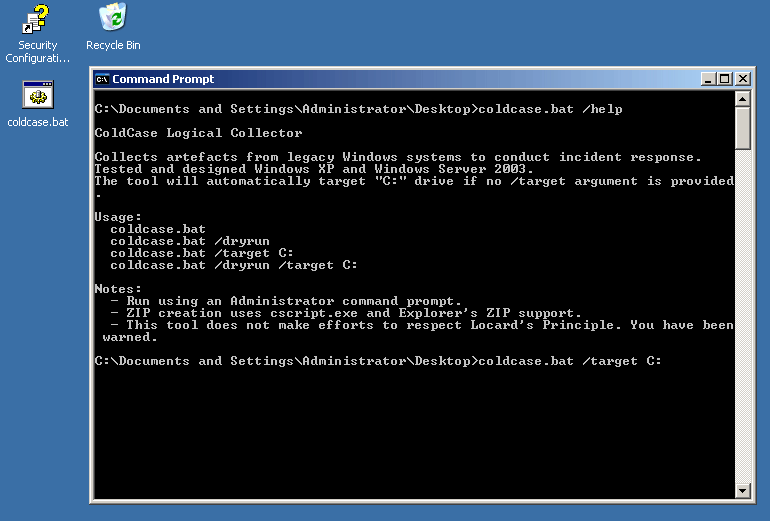

# ColdCase
Artefact collector designed for legacy versions of Windows. 



## Help

```
 ColdCase Logical Collector

 Collects artefacts from legacy Windows systems to conduct incident response.
 Tested and designed Windows XP and Windows Server 2003.
 The tool will automatically target "C:" drive if no /target argument is provided.

 Usage:
   coldcase.bat
   coldcase.bat /dryrun
   coldcase.bat /target C:
   coldcase.bat /dryrun /target C:

 Notes:
   - Run using an Administrator command prompt.
   - ZIP creation uses cscript.exe and Explorer's ZIP support.
   - This tool does not make efforts to respect Locard's Principle. You have been warned.
```

## Disclaimer

As explained in *Help*, This tool does not make extensive efforts to reduce interactions with a system. This is designed to act as a live incident response evidence collector, similar to [UNIX-like Artifacts Collector](https://github.com/tclahr/uac) running on a live system. **_It is purely up to the analyst to decide if this tool is fit for purpose for your investigation._** If in doubt, you should probably take a disk image.